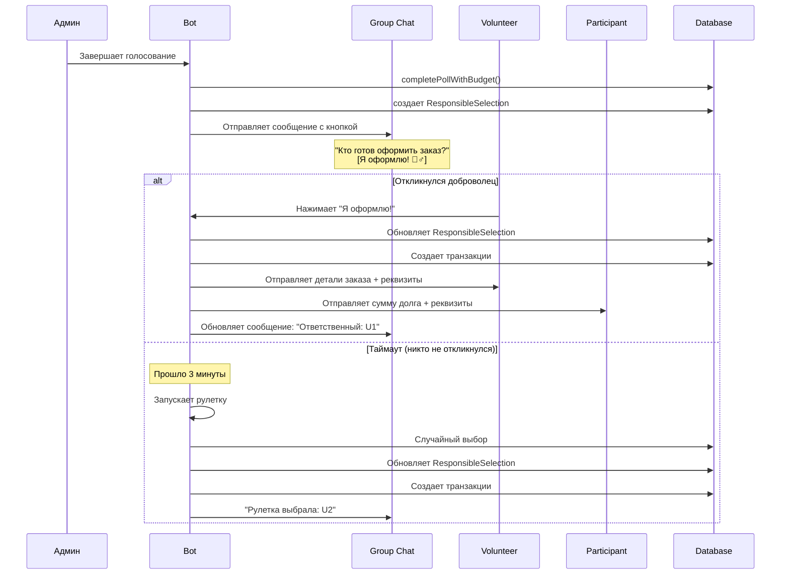
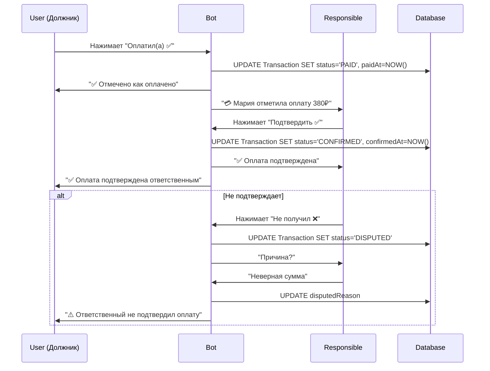

# Спецификация: Бюджетный трекер для Lunch Bot

## 📋 Содержание
1. [Обзор](#обзор)
2. [Текущее состояние системы](#текущее-состояние-системы)
3. [Новая функциональность](#новая-функциональность)
4. [Архитектура решения](#архитектура-решения)
5. [Схема базы данных](#схема-базы-данных)
6. [Логика работы](#логика-работы)
7. [API эндпоинты](#api-эндпоинты)
8. [UI компоненты](#ui-компоненты)
9. [Уведомления](#уведомления)
10. [Примеры использования](#примеры-использования)

---

## 🎯 Обзор

Бюджетный трекер расширяет существующую систему голосования за еду, добавляя:
- **Автоматический расчет расходов** для каждого участника на основе выбранных блюд
- **Выбор ответственного за оплату** (случайный или добровольный)
- **Управление долгами** с автоматическим расчетом кто кому и сколько должен
- **Уведомления с реквизитами** для перевода денег
- **История расходов** по группам и пользователям
- **Статистика бюджета** за период

---

## 📊 Текущее состояние системы

### Что уже реализовано:
✅ **Голосование за блюда** с поддержкой multi-winner режима
✅ **Выбор ответственного** через рулетку (случайный выбор из голосовавших)
✅ **Платежные реквизиты** в модели User (`paymentCard`, `paymentPhone`, `paymentDetails`)
✅ **Цены блюд** в модели MenuItem (поле `price`)
✅ **Система уведомлений** с шаблонами
✅ **Группировка участников** по выбранным блюдам в multi-winner режиме

### Что требуется добавить:
❌ Расчет долгов каждого участника
❌ Добровольный выбор ответственного (не только рулетка)
❌ Уведомление с детальным расчетом и реквизитами
❌ История транзакций и долгов
❌ Механизм подтверждения оплаты
❌ Напоминания о долгах
❌ Статистика расходов

---

## 🚀 Новая функциональность

### 1. Выбор ответственного за заказ

**Два режима:**

#### A. Случайный выбор (рулетка) - *уже реализовано*
- Автоматически выбирается случайный участник из проголосовавших
- Запускается сразу после завершения голосования
- Анимированное отображение процесса выбора

#### B. Добровольный выбор - *НОВОЕ*
- После завершения голосования отправляется сообщение в группу:
  ```
  🍽️ Голосование завершено!
  
  Кто готов оформить заказ и оплатить?
  [Кнопка: Я оформлю! 🙋‍♂️]
  
  Время на ожидание добровольца: 3 минуты
  Если никто не откликнется, запустится рулетка.
  ```
- Первый откликнувшийся становится ответственным
- Если за 3 минуты никто не откликнулся → автоматический запуск рулетки
- Можно настроить в параметрах группы: `volunteerTimeoutMinutes`

**Настройки группы (новые поля в Group.settings):**
```typescript
{
  responsibleSelectionMode: 'volunteer' | 'roulette' | 'volunteer_with_fallback', // по умолчанию 'volunteer_with_fallback'
  volunteerTimeoutMinutes: 3, // время ожидания добровольца
  autoStartRoulette: true, // запускать рулетку если нет добровольца
}
```

### 2. Расчет расходов и долгов

После выбора ответственного система автоматически:

1. **Рассчитывает сумму заказа** для каждого участника на основе цены выбранного блюда
2. **Определяет долги** каждого участника перед ответственным
3. **Создает записи транзакций** в базе данных
4. **Отправляет уведомления** всем участникам с детализацией

**Пример расчета:**
```
Участники:
- Алексей: Пицца Маргарита (450₽)
- Мария: Паста Карбонара (380₽)
- Иван: Пицца Маргарита (450₽)
- Ольга: Принесу своё (0₽)
- Дмитрий: Не обедаю (0₽)

Ответственный: Алексей

Долги:
- Мария → Алексею: 380₽
- Иван → Алексею: 450₽

Итого Алексей оплачивает: 1280₽ (450 + 380 + 450)
Вернут Алексею: 830₽ (380 + 450)
```

### 3. Уведомление с результатами и реквизитами

После выбора ответственного отправляется **два типа уведомлений**:

#### A. Уведомление ответственному (личное сообщение)
```
🎉 Вы выбраны ответственным за заказ!

📋 ДЕТАЛИ ЗАКАЗА:

🍽️ Кто что заказывает:
1. Пицца Маргарита — 2 человека (Алексей, Иван)
   💰 450₽ × 2 = 900₽

2. Паста Карбонара — 1 человек (Мария)
   💰 380₽ × 1 = 380₽

🥪 Принесут своё: 1 человек (Ольга)
⏭️ Не обедают: 1 человек (Дмитрий)

💵 ФИНАНСЫ:

Общая сумма заказа: 1 280₽
Ваша доля: 450₽
Вернут вам: 830₽

💳 КТО ДОЛЖЕН ПЕРЕВЕСТИ:

1. Мария → 380₽
   📱 @maria_username
   
2. Иван → 450₽
   📱 @ivan_username

📌 ВАШИ РЕКВИЗИТЫ ДЛЯ ПЕРЕВОДА:
💳 Карта: **** 1234 (настроить в профиле)
📱 Телефон: +7 900 123-45-67
ℹ️ Комментарий к платежу: Обед 24.10.2025

⏰ Ожидаемое время доставки: 13:00

[Кнопка: Все оплатили ✅]
[Кнопка: Напомнить должникам 🔔]
```

#### B. Уведомление участникам (личные сообщения)
```
🍽️ Результаты голосования

Ваш выбор: Паста Карбонара
💰 Сумма: 380₽

👤 Ответственный за заказ: Алексей Иванов

💳 РЕКВИЗИТЫ ДЛЯ ОПЛАТЫ:

Карта: 2202 2006 **** 1234 (Сбербанк)
📱 Телефон: +7 900 123-45-67 (СБП)

💬 Комментарий к платежу: Обед 24.10.2025

⏰ Ожидаемое время: 13:00
📍 Место получения: Офис, переговорная 3

[Кнопка: Оплатил(а) ✅]
[Кнопка: Открыть СБП 💳]
[Кнопка: Написать ответственному 💬]
```

#### C. Уведомление в группу (сводное сообщение)
```
✅ Голосование завершено!

🎯 Ответственный: Алексей Иванов

📊 СТАТИСТИКА:

🍽️ Заказали:
• Пицца Маргарита — 2 чел. (900₽)
• Паста Карбонара — 1 чел. (380₽)

🥪 Принесут своё — 1 чел.
⏭️ Не обедают — 1 чел.

💰 Общая сумма: 1 280₽
👥 Участников: 3

⏰ Заказ будет готов к 13:00

Детали отправлены каждому в личные сообщения.
```

### 4. Подтверждение оплаты

**Варианты подтверждения:**

#### Вариант A: Ручное подтверждение (MVP)
- Участник нажимает кнопку "Оплатил(а) ✅"
- Ответственный видит обновленный список (кто оплатил)
- Ответственный может подтвердить получение от каждого

#### Вариант B: Автоматическое (будущая версия)
- Интеграция с платежными системами (СБП API)
- Автоматическое подтверждение при поступлении платежа
- Сверка суммы и комментария

**Статусы оплаты:**
- `PENDING` - ожидается оплата (по умолчанию)
- `PAID` - участник отметил что оплатил
- `CONFIRMED` - ответственный подтвердил получение
- `DISPUTED` - есть разногласия

### 5. Управление долгами

**Функции:**
- Просмотр текущих долгов (кому и сколько)
- История долгов (оплаченные и непогашенные)
- Напоминания о долгах (автоматические и ручные)
- Закрытие долгов (подтверждение оплаты)

**Команды бота:**
- `/debts` - мои текущие долги
- `/credits` - кто мне должен (для ответственных)
- `/history` - история расходов
- `/reminddebt` - напомнить должнику

### 6. Статистика бюджета

**Для пользователя:**
- Общая сумма потрачена за период
- Среднее за обед
- Топ любимых блюд с суммами
- Сколько раз был ответственным
- Баланс (разница между оплаченным и возвращенным)

**Для группы:**
- Общая сумма заказов за период
- Средняя стоимость обеда на человека
- Топ блюд по популярности и выручке
- Самые активные участники
- Топ ответственных

---

## 🏗️ Архитектура решения

### Новые сервисы

#### 1. `BudgetService` - управление финансами
```typescript
class BudgetService {
  // Расчет долгов для голосования
  async calculateDebts(pollId: number): Promise<DebtCalculation>
  
  // Создание транзакций после завершения голосования
  async createTransactionsFromPoll(pollId: number, responsibleUserId: number): Promise<Transaction[]>
  
  // Подтверждение оплаты участником
  async markAsPaid(transactionId: number, userId: number): Promise<Transaction>
  
  // Подтверждение получения ответственным
  async confirmPayment(transactionId: number, responsibleUserId: number): Promise<Transaction>
  
  // Получение активных долгов пользователя
  async getUserDebts(userId: number): Promise<DebtSummary>
  
  // Получение кредитов (кто должен пользователю)
  async getUserCredits(userId: number): Promise<CreditSummary>
  
  // Статистика расходов пользователя
  async getUserBudgetStats(userId: number, period?: DateRange): Promise<UserBudgetStats>
  
  // Статистика расходов группы
  async getGroupBudgetStats(groupId: number, period?: DateRange): Promise<GroupBudgetStats>
}
```

#### 2. `ResponsibleService` - выбор ответственного
```typescript
class ResponsibleService {
  // Запуск процесса выбора ответственного
  async startResponsibleSelection(pollId: number): Promise<void>
  
  // Обработка добровольного выбора
  async handleVolunteer(pollId: number, userId: number): Promise<void>
  
  // Запуск рулетки (fallback или основной метод)
  async runRoulette(pollId: number): Promise<RouletteResult>
  
  // Отмена выбора (если нужно перевыбрать)
  async cancelSelection(pollId: number): Promise<void>
}
```

#### 3. `ReminderService` - напоминания о долгах
```typescript
class ReminderService {
  // Отправка напоминания о долге
  async sendDebtReminder(transactionId: number): Promise<void>
  
  // Автоматические напоминания (запускается по расписанию)
  async sendScheduledReminders(): Promise<void>
  
  // Настройка расписания напоминаний
  async configureReminders(groupId: number, config: ReminderConfig): Promise<void>
}
```

### Интеграция с существующими сервисами

**Изменения в `PollService`:**
```typescript
// После completePollMultiWinner добавить:
async completePollWithBudget(
  pollId: number, 
  completedBy: number,
  responsibleMode: 'volunteer' | 'roulette' | 'volunteer_with_fallback'
): Promise<PollResult> {
  // 1. Завершить голосование (multi-winner)
  const result = await this.completePollMultiWinner(pollId, completedBy);
  
  // 2. Запустить выбор ответственного
  await ResponsibleService.startResponsibleSelection(pollId);
  
  // 3. После выбора создать транзакции
  // (выполнится в ResponsibleService после выбора)
  
  return result;
}
```

**Изменения в `NotificationService`:**
```typescript
// Добавить новые шаблоны:
- NotificationType.RESPONSIBLE_SELECTED - выбран ответственный
- NotificationType.DEBT_CREATED - создан долг
- NotificationType.PAYMENT_REMINDER - напоминание об оплате
- NotificationType.PAYMENT_RECEIVED - подтверждение оплаты
```

---

## 🗄️ Схема базы данных

### Новые модели

#### 1. Transaction - транзакции/долги
```prisma
model Transaction {
  id              Int       @id @default(autoincrement())
  pollId          Int       @map("poll_id")
  fromUserId      Int       @map("from_user_id")      // Кто должен
  toUserId        Int       @map("to_user_id")        // Кому должен (ответственный)
  amount          Float                                // Сумма долга
  menuItemId      Int?      @map("menu_item_id")      // Связанное блюдо
  status          String    @default("PENDING")       // PENDING, PAID, CONFIRMED, DISPUTED
  paidAt          DateTime? @map("paid_at")           // Когда участник отметил оплату
  confirmedAt     DateTime? @map("confirmed_at")      // Когда ответственный подтвердил
  disputedReason  String?   @map("disputed_reason")   // Причина спора
  reminderCount   Int       @default(0) @map("reminder_count") // Количество напоминаний
  lastReminderAt  DateTime? @map("last_reminder_at")  // Последнее напоминание
  createdAt       DateTime  @default(now()) @map("created_at")
  updatedAt       DateTime  @updatedAt @map("updated_at")
  
  poll            Poll      @relation(fields: [pollId], references: [id], onDelete: Cascade)
  fromUser        User      @relation("UserDebts", fields: [fromUserId], references: [id])
  toUser          User      @relation("UserCredits", fields: [toUserId], references: [id])
  menuItem        MenuItem? @relation(fields: [menuItemId], references: [id])
  
  @@index([fromUserId, status])
  @@index([toUserId, status])
  @@index([pollId])
  @@index([status])
  @@index([createdAt])
  @@map("transactions")
}
```

#### 2. ResponsibleSelection - процесс выбора ответственного
```prisma
model ResponsibleSelection {
  id                  Int       @id @default(autoincrement())
  pollId              Int       @unique @map("poll_id")
  mode                String                              // 'volunteer' | 'roulette' | 'volunteer_with_fallback'
  status              String    @default("WAITING")       // WAITING, VOLUNTEER_SELECTED, ROULETTE_RUN, COMPLETED, CANCELLED
  selectedUserId      Int?      @map("selected_user_id")  // Выбранный ответственный
  volunteerUserId     Int?      @map("volunteer_user_id") // ID добровольца (если откликнулся)
  rouletteWinnerId    Int?      @map("roulette_winner_id")// ID победителя рулетки (если запущена)
  timeoutAt           DateTime? @map("timeout_at")        // Время истечения ожидания добровольца
  completedAt         DateTime? @map("completed_at")      // Когда завершен выбор
  messageId           Int?      @map("message_id")        // ID сообщения с кнопкой в группе
  chatId              BigInt?   @map("chat_id")           // ID чата группы
  createdAt           DateTime  @default(now()) @map("created_at")
  updatedAt           DateTime  @updatedAt @map("updated_at")
  
  poll                Poll      @relation(fields: [pollId], references: [id], onDelete: Cascade)
  selectedUser        User?     @relation("ResponsibleUser", fields: [selectedUserId], references: [id])
  volunteerUser       User?     @relation("VolunteerUser", fields: [volunteerUserId], references: [id])
  rouletteWinner      User?     @relation("RouletteWinner", fields: [rouletteWinnerId], references: [id])
  
  @@index([pollId])
  @@index([status])
  @@index([timeoutAt])
  @@map("responsible_selections")
}
```

#### 3. PaymentReminder - напоминания об оплате
```prisma
model PaymentReminder {
  id              Int       @id @default(autoincrement())
  transactionId   Int       @map("transaction_id")
  sentAt          DateTime  @default(now()) @map("sent_at")
  type            String    @default("AUTO")  // AUTO, MANUAL
  sentBy          Int?      @map("sent_by")   // Кто отправил (для MANUAL)
  message         String?                     // Кастомное сообщение (для MANUAL)
  createdAt       DateTime  @default(now()) @map("created_at")
  
  transaction     Transaction @relation(fields: [transactionId], references: [id], onDelete: Cascade)
  sender          User?       @relation(fields: [sentBy], references: [id])
  
  @@index([transactionId])
  @@index([sentAt])
  @@map("payment_reminders")
}
```

### Изменения в существующих моделях

#### User - добавить relations
```prisma
model User {
  // ... существующие поля ...
  
  // Новые relations
  debts                   Transaction[]           @relation("UserDebts")     // Мои долги
  credits                 Transaction[]           @relation("UserCredits")   // Кто мне должен
  responsibleSelections   ResponsibleSelection[]  @relation("ResponsibleUser")
  volunteerSelections     ResponsibleSelection[]  @relation("VolunteerUser")
  rouletteWins            ResponsibleSelection[]  @relation("RouletteWinner")
  sentReminders           PaymentReminder[]
}
```

#### Poll - добавить relation
```prisma
model Poll {
  // ... существующие поля ...
  
  // Новые relations
  transactions          Transaction[]
  responsibleSelection  ResponsibleSelection?
}
```

#### MenuItem - добавить relation
```prisma
model MenuItem {
  // ... существующие поля ...
  
  // Новая relation
  transactions  Transaction[]
}
```

#### Group.settings - новые поля
```json
{
  "responsibleSelectionMode": "volunteer_with_fallback",
  "volunteerTimeoutMinutes": 3,
  "autoStartRoulette": true,
  "autoRemindersEnabled": true,
  "reminderSchedule": [
    { "afterHours": 2, "message": "Напоминание об оплате обеда" },
    { "afterHours": 24, "message": "Последнее напоминание об оплате" }
  ],
  "paymentConfirmationRequired": true
}
```

---

## ⚙️ Логика работы

### Сценарий 1: Завершение голосования с добровольным выбором



### Сценарий 2: Подтверждение оплаты



### Сценарий 3: Автоматические напоминания

```typescript
// Cron job: каждый час
async function sendScheduledReminders() {
  const settings = await getGroupSettings(groupId);
  
  if (!settings.autoRemindersEnabled) return;
  
  // Получаем неоплаченные транзакции
  const pendingTransactions = await prisma.transaction.findMany({
    where: { status: 'PENDING' },
    include: { poll: true, fromUser: true, toUser: true }
  });
  
  for (const tx of pendingTransactions) {
    const hoursSinceCreated = (Date.now() - tx.createdAt.getTime()) / (1000 * 60 * 60);
    
    // Проверяем расписание напоминаний
    for (const schedule of settings.reminderSchedule) {
      if (Math.abs(hoursSinceCreated - schedule.afterHours) < 0.5) {
        // Время отправить напоминание
        await ReminderService.sendDebtReminder(tx.id);
        break;
      }
    }
  }
}
```

---

## 🔌 API эндпоинты

### Budget API

```typescript
// GET /api/budget/debts - мои текущие долги
GET /api/budget/debts?userId=123&status=PENDING

Response: {
  debts: [
    {
      id: 1,
      amount: 380,
      toUser: { id: 2, firstName: "Алексей", paymentCard: "****1234" },
      poll: { id: 5, startedAt: "2025-10-24T10:00:00Z" },
      menuItem: { name: "Паста Карбонара" },
      status: "PENDING",
      createdAt: "2025-10-24T12:00:00Z"
    }
  ],
  total: 380
}

// GET /api/budget/credits - кто мне должен
GET /api/budget/credits?userId=123&status=PENDING

Response: {
  credits: [
    {
      id: 2,
      amount: 450,
      fromUser: { id: 3, firstName: "Иван", username: "ivan" },
      status: "PENDING",
      createdAt: "2025-10-24T12:00:00Z"
    }
  ],
  total: 450
}

// POST /api/budget/mark-paid - отметить как оплаченное
POST /api/budget/mark-paid
Body: {
  transactionId: 1,
  userId: 123
}

Response: {
  success: true,
  transaction: { id: 1, status: "PAID", paidAt: "2025-10-24T13:00:00Z" }
}

// POST /api/budget/confirm-payment - подтвердить получение
POST /api/budget/confirm-payment
Body: {
  transactionId: 1,
  responsibleUserId: 2
}

Response: {
  success: true,
  transaction: { id: 1, status: "CONFIRMED", confirmedAt: "2025-10-24T13:05:00Z" }
}

// POST /api/budget/dispute-payment - оспорить оплату
POST /api/budget/dispute-payment
Body: {
  transactionId: 1,
  responsibleUserId: 2,
  reason: "Неверная сумма"
}

Response: {
  success: true,
  transaction: { id: 1, status: "DISPUTED", disputedReason: "Неверная сумма" }
}

// GET /api/budget/stats/user - статистика пользователя
GET /api/budget/stats/user?userId=123&from=2025-10-01&to=2025-10-31

Response: {
  totalSpent: 12450,        // Всего потрачено
  averagePerMeal: 450,      // Среднее за обед
  mealsCount: 28,           // Количество обедов
  timesResponsible: 5,      // Раз был ответственным
  totalPaidForOthers: 15600,// Оплатил за других
  totalReceived: 13200,     // Вернули ему
  balance: -2400,           // Баланс (отрицательный = в минусе)
  favoriteItems: [
    { name: "Пицца Маргарита", count: 8, totalSpent: 3600 }
  ]
}

// GET /api/budget/stats/group - статистика группы
GET /api/budget/stats/group?groupId=1&from=2025-10-01&to=2025-10-31

Response: {
  totalOrdersAmount: 125000,
  ordersCount: 45,
  averagePerOrder: 2777,
  participantsCount: 12,
  topItems: [
    { name: "Пицца Маргарита", orders: 35, revenue: 15750 }
  ],
  topResponsible: [
    { userId: 2, firstName: "Алексей", timesResponsible: 8 }
  ]
}

// POST /api/budget/remind - отправить напоминание
POST /api/budget/remind
Body: {
  transactionId: 1,
  sentBy: 2,  // ID ответственного
  message: "Пожалуйста, переведи деньги за обед" // опционально
}

Response: {
  success: true,
  reminder: { id: 1, sentAt: "2025-10-24T14:00:00Z" }
}
```

### Responsible Selection API

```typescript
// POST /api/responsible/volunteer - откликнуться добровольцем
POST /api/responsible/volunteer
Body: {
  pollId: 5,
  userId: 123
}

Response: {
  success: true,
  selection: {
    id: 1,
    pollId: 5,
    selectedUserId: 123,
    status: "VOLUNTEER_SELECTED"
  }
}

// POST /api/responsible/roulette - запустить рулетку вручную
POST /api/responsible/roulette
Body: {
  pollId: 5,
  requestedBy: 2  // ID админа
}

Response: {
  success: true,
  selection: {
    id: 1,
    pollId: 5,
    rouletteWinnerId: 124,
    selectedUserId: 124,
    status: "ROULETTE_RUN"
  },
  rouletteResult: {
    responsibleUserId: 124,
    responsibleUserName: "Иван",
    animationData: { ... }
  }
}

// GET /api/responsible/status/:pollId - статус выбора ответственного
GET /api/responsible/status/5

Response: {
  selection: {
    id: 1,
    pollId: 5,
    mode: "volunteer_with_fallback",
    status: "WAITING",
    timeoutAt: "2025-10-24T12:03:00Z",
    timeLeft: 120  // секунд
  }
}
```

---

## 🎨 UI компоненты

### Frontend - новые страницы

#### 1. `/budget/debts` - Мои долги
```typescript
<DebtsPage>
  <Header>Мои долги</Header>
  
  <DebtsList>
    {debts.map(debt => (
      <DebtCard key={debt.id}>
        <Amount>{debt.amount}₽</Amount>
        <Creditor>→ {debt.toUser.firstName}</Creditor>
        <Details>
          <MenuItem>{debt.menuItem.name}</MenuItem>
          <Date>{formatDate(debt.createdAt)}</Date>
        </Details>
        <PaymentInfo>
          <Card>{debt.toUser.paymentCard}</Card>
          <Phone>{debt.toUser.paymentPhone}</Phone>
        </PaymentInfo>
        <Actions>
          <Button onClick={markAsPaid}>Оплатил(а) ✅</Button>
          <Button onClick={openSBP}>Открыть СБП 💳</Button>
          <Button onClick={writeMessage}>Написать 💬</Button>
        </Actions>
        <Status status={debt.status} />
      </DebtCard>
    ))}
  </DebtsList>
  
  <Summary>
    <Total>Всего долгов: {totalDebts}₽</Total>
  </Summary>
</DebtsPage>
```

#### 2. `/budget/credits` - Кто мне должен
```typescript
<CreditsPage>
  <Header>Мои кредиты</Header>
  
  <CreditsList>
    {credits.map(credit => (
      <CreditCard key={credit.id}>
        <Amount>{credit.amount}₽</Amount>
        <Debtor>← {credit.fromUser.firstName}</Debtor>
        <Status status={credit.status}>
          {credit.status === 'PAID' && '⏳ Ожидает подтверждения'}
          {credit.status === 'CONFIRMED' && '✅ Подтверждено'}
          {credit.status === 'PENDING' && '⏰ Ожидается оплата'}
        </Status>
        <Actions>
          {credit.status === 'PAID' && (
            <>
              <Button onClick={confirmPayment}>Подтвердить ✅</Button>
              <Button onClick={disputePayment}>Не получил ❌</Button>
            </>
          )}
          {credit.status === 'PENDING' && (
            <Button onClick={sendReminder}>Напомнить 🔔</Button>
          )}
        </Actions>
        <ReminderCount>
          {credit.reminderCount > 0 && `Напоминаний: ${credit.reminderCount}`}
        </ReminderCount>
      </CreditCard>
    ))}
  </CreditsList>
  
  <Summary>
    <Total>Всего должны: {totalCredits}₽</Total>
  </Summary>
</CreditsPage>
```

#### 3. `/budget/stats` - Статистика
```typescript
<BudgetStatsPage>
  <Header>Статистика расходов</Header>
  
  <PeriodSelector>
    <Button active={period === 'week'}>Неделя</Button>
    <Button active={period === 'month'}>Месяц</Button>
    <Button active={period === 'year'}>Год</Button>
  </PeriodSelector>
  
  <Overview>
    <Card>
      <Icon>💰</Icon>
      <Label>Всего потрачено</Label>
      <Value>{stats.totalSpent}₽</Value>
    </Card>
    <Card>
      <Icon>🍽️</Icon>
      <Label>Среднее за обед</Label>
      <Value>{stats.averagePerMeal}₽</Value>
    </Card>
    <Card>
      <Icon>📊</Icon>
      <Label>Обедов</Label>
      <Value>{stats.mealsCount}</Value>
    </Card>
    <Card>
      <Icon>🎯</Icon>
      <Label>Раз ответственный</Label>
      <Value>{stats.timesResponsible}</Value>
    </Card>
  </Overview>
  
  <BalanceCard balance={stats.balance}>
    <Label>Баланс</Label>
    <Value positive={stats.balance > 0}>
      {stats.balance > 0 ? '+' : ''}{stats.balance}₽
    </Value>
    <Description>
      {stats.balance > 0 
        ? 'Вам должны больше, чем вы должны'
        : 'Вы должны больше, чем вам должны'
      }
    </Description>
  </BalanceCard>
  
  <FavoriteItems>
    <Header>Любимые блюда</Header>
    {stats.favoriteItems.map(item => (
      <ItemRow key={item.name}>
        <Name>{item.name}</Name>
        <Count>×{item.count}</Count>
        <Total>{item.totalSpent}₽</Total>
      </ItemRow>
    ))}
  </FavoriteItems>
  
  <Chart>
    <SpendingChart data={stats.spendingByDate} />
  </Chart>
</BudgetStatsPage>
```

#### 4. Компонент для выбора ответственного (в группе)
```typescript
<ResponsibleSelectionWidget pollId={pollId}>
  {status === 'WAITING' && (
    <VolunteerPrompt>
      <Message>Кто готов оформить заказ?</Message>
      <Button onClick={handleVolunteer}>Я оформлю! 🙋‍♂️</Button>
      <Countdown timeLeft={timeLeft}>
        Ожидание: {formatTime(timeLeft)}
      </Countdown>
      <Hint>
        Если никто не откликнется, запустится рулетка
      </Hint>
    </VolunteerPrompt>
  )}
  
  {status === 'VOLUNTEER_SELECTED' && (
    <VolunteerSelected>
      <Message>✅ Доброволец найден!</Message>
      <Avatar user={selectedUser} />
      <Name>{selectedUser.firstName}</Name>
    </VolunteerSelected>
  )}
  
  {status === 'ROULETTE_RUN' && (
    <RouletteAnimation>
      <Message>🎲 Запускаем рулетку...</Message>
      <Spinner />
    </RouletteAnimation>
  )}
</ResponsibleSelectionWidget>
```

### Telegram Mini App - новые разделы в навигации

```typescript
<BottomNavigation>
  <NavItem to="/" icon="🍽️">Голосование</NavItem>
  <NavItem to="/history" icon="📜">История</NavItem>
  <NavItem to="/budget" icon="💰">Бюджет</NavItem>  {/* НОВОЕ */}
  <NavItem to="/profile" icon="👤">Профиль</NavItem>
</BottomNavigation>

// В разделе "Бюджет":
<BudgetMenu>
  <MenuItem to="/budget/debts">
    <Icon>💸</Icon>
    <Label>Мои долги</Label>
    {totalDebts > 0 && <Badge>{totalDebts}₽</Badge>}
  </MenuItem>
  
  <MenuItem to="/budget/credits">
    <Icon>💰</Icon>
    <Label>Мне должны</Label>
    {totalCredits > 0 && <Badge>{totalCredits}₽</Badge>}
  </MenuItem>
  
  <MenuItem to="/budget/stats">
    <Icon>📊</Icon>
    <Label>Статистика</Label>
  </MenuItem>
</BudgetMenu>
```

---

## 📢 Уведомления

### Типы уведомлений (NotificationType)

```typescript
enum NotificationType {
  // ... существующие ...
  POLL_STARTED = 'poll_started',
  POLL_ENDED = 'poll_ended',
  ROULETTE_WINNER = 'roulette_winner',
  
  // НОВЫЕ:
  RESPONSIBLE_SELECTION_STARTED = 'responsible_selection_started',  // Начался выбор ответственного
  VOLUNTEER_SELECTED = 'volunteer_selected',                        // Выбран доброволец
  ROULETTE_STARTED = 'roulette_started',                           // Запущена рулетка (fallback)
  DEBT_CREATED = 'debt_created',                                   // Создан долг (участнику)
  RESPONSIBLE_ASSIGNED = 'responsible_assigned',                    // Назначен ответственным
  PAYMENT_MARKED = 'payment_marked',                               // Участник отметил оплату
  PAYMENT_CONFIRMED = 'payment_confirmed',                         // Ответственный подтвердил
  PAYMENT_DISPUTED = 'payment_disputed',                           // Оспорена оплата
  PAYMENT_REMINDER = 'payment_reminder',                           // Напоминание об оплате
  ALL_PAID = 'all_paid',                                          // Все оплатили
}
```

### Шаблоны уведомлений

#### RESPONSIBLE_SELECTION_STARTED (в группу)
```
🍽️ Голосование завершено!

📊 Результаты:
• Пицца Маргарита — 2 чел. (900₽)
• Паста Карбонара — 1 чел. (380₽)

💰 Общая сумма: 1 280₽

🙋‍♂️ Кто готов оформить заказ и оплатить?

[Кнопка: Я оформлю! 🙋‍♂️]

⏱️ Ожидание добровольца: 3 минуты
Если никто не откликнется, запустится рулетка.
```

#### VOLUNTEER_SELECTED (в группу)
```
✅ Ответственный найден!

👤 Доброволец: Алексей Иванов
💰 Сумма заказа: 1 280₽

Детали отправлены всем участникам в личные сообщения.
```

#### DEBT_CREATED (участнику)
```
🍽️ Результаты голосования

Ваш заказ: Паста Карбонара
💰 Сумма: 380₽

👤 Ответственный: Алексей Иванов

💳 РЕКВИЗИТЫ ДЛЯ ОПЛАТЫ:

Карта: 2202 2006 **** 1234
📱 Телефон: +7 900 123-45-67 (СБП)
ℹ️ Имя получателя: Алексей Иванов

💬 Комментарий к платежу: Обед 24.10.2025

⏰ Заказ будет готов к 13:00

[Кнопка: Оплатил(а) ✅]
[Кнопка: Открыть СБП 💳]
[Кнопка: Написать @alexey_ivanov 💬]
```

#### RESPONSIBLE_ASSIGNED (ответственному)
```
🎉 Вы выбраны ответственным за заказ!

📋 ДЕТАЛИ ЗАКАЗА:

🍽️ Заказы:
1. Пицца Маргарита — 2 чел. (Алексей, Иван) — 900₽
2. Паста Карбонара — 1 чел. (Мария) — 380₽

🥪 Принесут своё: 1 чел. (Ольга)
⏭️ Не обедают: 1 чел. (Дмитрий)

💵 ФИНАНСЫ:

Общая сумма: 1 280₽
Ваша доля: 450₽
Вернут вам: 830₽

💳 ПЕРЕВОДЫ ОЖИДАЮТСЯ ОТ:

1. Мария → 380₽
   📱 @maria_username
   Status: ⏰ Ожидается
   
2. Иван → 450₽
   📱 @ivan_username
   Status: ⏰ Ожидается

📌 ВАШИ РЕКВИЗИТЫ:
💳 Карта: 2202 2006 **** 1234
📱 Телефон: +7 900 123-45-67
(Участники уже получили их)

⏰ Заказ на 13:00

[Кнопка: Все оплатили ✅]
[Кнопка: Напомнить должникам 🔔]
[Кнопка: Управлять оплатами 💳]
```

#### PAYMENT_MARKED (ответственному)
```
💳 Получена оплата!

Мария отметила, что оплатила 380₽ за Паста Карбонара

[Кнопка: Подтвердить получение ✅]
[Кнопка: Не получил ❌]

Статус оплат:
✅ Мария — 380₽ (ожидает подтверждения)
⏰ Иван — 450₽ (ожидается)
```

#### PAYMENT_CONFIRMED (участнику)
```
✅ Оплата подтверждена!

Алексей подтвердил получение 380₽

Спасибо за участие! 🎉
```

#### PAYMENT_REMINDER (участнику)
```
⏰ Напоминание об оплате

Вы ещё не оплатили обед от 24.10.2025

💰 Сумма: 380₽
👤 Ответственный: Алексей Иванов

💳 Реквизиты:
Карта: 2202 2006 **** 1234
📱 Телефон: +7 900 123-45-67

[Кнопка: Оплатил(а) ✅]
[Кнопка: Открыть СБП 💳]
```

#### ALL_PAID (ответственному)
```
🎊 Все оплатили!

Все участники подтвердили оплату за обед 24.10.2025

💰 Получено: 830₽

Подробности:
✅ Мария — 380₽
✅ Иван — 450₽

Спасибо за организацию! 🙏
```

---

## 📝 Примеры использования

### Пример 1: Стандартный flow с добровольцем

```
1. Админ завершает голосование (13:00)
   → PollService.completePollWithBudget(pollId, adminId, 'volunteer_with_fallback')

2. Бот отправляет в группу (13:00):
   "🍽️ Голосование завершено! Кто готов оформить заказ? [Я оформлю!]"

3. Алексей нажимает кнопку (13:01)
   → ResponsibleService.handleVolunteer(pollId, alexeyId)
   → Обновляется ResponsibleSelection: status='VOLUNTEER_SELECTED', selectedUserId=alexeyId

4. Создаются транзакции (13:01):
   - Мария → Алексей: 380₽ (PENDING)
   - Иван → Алексей: 450₽ (PENDING)

5. Отправляются уведомления (13:01):
   → Алексею: детали заказа + кому платить
   → Марии: сумма долга + реквизиты Алексея
   → Ивану: сумма долга + реквизиты Алексея
   → В группу: "✅ Ответственный: Алексей"

6. Мария переводит деньги и нажимает "Оплатил(а)" (13:15)
   → BudgetService.markAsPaid(transactionId, mariaId)
   → Transaction: status='PAID', paidAt='13:15'
   → Алексею: "💳 Мария оплатила 380₽ [Подтвердить ✅]"

7. Алексей подтверждает (13:20)
   → BudgetService.confirmPayment(transactionId, alexeyId)
   → Transaction: status='CONFIRMED', confirmedAt='13:20'
   → Марии: "✅ Оплата подтверждена!"

8. Иван не оплачивает → автоматическое напоминание (15:00, через 2 часа)
   → ReminderService.sendDebtReminder(transactionId)
   → Ивану: "⏰ Напоминание об оплате 450₽"

9. Иван оплачивает и подтверждает (15:30)
   → Все транзакции в статусе CONFIRMED
   → Алексею: "🎊 Все оплатили! Получено: 830₽"
```

### Пример 2: Fallback на рулетку

```
1. Админ завершает голосование (13:00)
   → Отправляется сообщение с кнопкой в группу
   → ResponsibleSelection: status='WAITING', timeoutAt='13:03'

2. Никто не откликается в течение 3 минут (13:00 - 13:03)

3. Запускается автоматическая рулетка (13:03)
   → ResponsibleService.runRoulette(pollId)
   → Случайный выбор: Иван
   → ResponsibleSelection: status='ROULETTE_RUN', rouletteWinnerId=ivanId

4. Далее аналогично примеру 1 (создание транзакций и уведомления)
```

### Пример 3: Просмотр долгов и статистики

```
1. Пользователь открывает Mini App → раздел "Бюджет" (14:00)

2. Видит свои долги:
   - Алексею Иванову: 380₽ (⏰ Ожидается оплата)
   - Марии Петровой: 250₽ (✅ Подтверждено)

3. Нажимает на долг → открывается детальная карточка:
   - Сумма: 380₽
   - За что: Паста Карбонара
   - Дата: 24.10.2025
   - Реквизиты: карта **** 1234, тел. +7 900...
   - [Оплатил(а)] [Открыть СБП] [Написать]

4. Переходит в "Статистика":
   - Всего потрачено за месяц: 12 450₽
   - Среднее за обед: 445₽
   - Обедов: 28
   - Раз был ответственным: 5
   - Баланс: -300₽ (должен больше, чем ему должны)
```

---

## 🎛️ Настройки

### Настройки группы (в Group.settings JSON)

```typescript
interface GroupBudgetSettings {
  // Режим выбора ответственного
  responsibleSelectionMode: 'volunteer' | 'roulette' | 'volunteer_with_fallback';
  
  // Время ожидания добровольца (минуты)
  volunteerTimeoutMinutes: number; // по умолчанию 3
  
  // Автоматически запускать рулетку при таймауте
  autoStartRoulette: boolean; // по умолчанию true
  
  // Включить автоматические напоминания
  autoRemindersEnabled: boolean; // по умолчанию true
  
  // Расписание напоминаний
  reminderSchedule: Array<{
    afterHours: number;      // Через сколько часов после создания долга
    message?: string;        // Кастомное сообщение (опционально)
  }>;
  // По умолчанию: [{ afterHours: 2 }, { afterHours: 24 }]
  
  // Требовать подтверждение оплаты ответственным
  paymentConfirmationRequired: boolean; // по умолчанию true
  
  // Автоматически закрывать долг если участник отметил оплату
  autoConfirmPayment: boolean; // по умолчанию false
  
  // Максимальное количество напоминаний
  maxReminders: number; // по умолчанию 3
}
```

### Команды бота для настроек

```
/budget_settings - открыть настройки бюджета группы (только админы)
```

### UI настроек (Mini App, раздел Admin)

```typescript
<BudgetSettingsPage groupId={groupId}>
  <Section>
    <Title>Выбор ответственного</Title>
    <RadioGroup value={settings.responsibleSelectionMode}>
      <Radio value="volunteer">
        Только добровольцы
        <Description>Всегда ждем добровольца, рулетка не запускается</Description>
      </Radio>
      <Radio value="roulette">
        Только рулетка
        <Description>Сразу запускается рулетка</Description>
      </Radio>
      <Radio value="volunteer_with_fallback">
        Доброволец с fallback
        <Description>Сначала ждем добровольца, потом рулетка</Description>
      </Radio>
    </RadioGroup>
    
    {settings.responsibleSelectionMode.includes('volunteer') && (
      <Input
        label="Время ожидания добровольца (минуты)"
        type="number"
        value={settings.volunteerTimeoutMinutes}
        min={1}
        max={10}
      />
    )}
  </Section>
  
  <Section>
    <Title>Напоминания об оплате</Title>
    <Switch
      label="Автоматические напоминания"
      checked={settings.autoRemindersEnabled}
    />
    
    {settings.autoRemindersEnabled && (
      <ReminderSchedule>
        {settings.reminderSchedule.map((schedule, index) => (
          <ScheduleItem key={index}>
            <Input
              label="Через (часов)"
              type="number"
              value={schedule.afterHours}
            />
            <Input
              label="Сообщение (опционально)"
              type="text"
              value={schedule.message}
            />
            <Button onClick={() => removeSchedule(index)}>🗑️</Button>
          </ScheduleItem>
        ))}
        <Button onClick={addSchedule}>+ Добавить напоминание</Button>
      </ReminderSchedule>
    )}
  </Section>
  
  <Section>
    <Title>Подтверждение оплаты</Title>
    <Switch
      label="Требовать подтверждение от ответственного"
      checked={settings.paymentConfirmationRequired}
    />
    <Switch
      label="Автоматически подтверждать при отметке участника"
      checked={settings.autoConfirmPayment}
      disabled={!settings.paymentConfirmationRequired}
    />
  </Section>
  
  <Button type="submit">Сохранить настройки</Button>
</BudgetSettingsPage>
```

---

## 🚀 План реализации (фазы)

### Фаза 1: MVP - Базовый функционал (2-3 недели)
- [ ] Модели БД: Transaction, ResponsibleSelection
- [ ] BudgetService: расчет долгов, создание транзакций
- [ ] ResponsibleService: выбор ответственного (только рулетка)
- [ ] Интеграция с PollService (создание транзакций после завершения)
- [ ] Уведомления: DEBT_CREATED, RESPONSIBLE_ASSIGNED
- [ ] Frontend: страница "Мои долги" (просмотр)
- [ ] Frontend: страница "Мне должны" (просмотр)
- [ ] Ручное подтверждение оплаты

### Фаза 2: Добровольный выбор (1-2 недели)
- [ ] ResponsibleService: режим volunteer_with_fallback
- [ ] Сообщение с кнопкой в группу
- [ ] Обработка откликов добровольцев
- [ ] Таймаут и fallback на рулетку
- [ ] Настройки группы (responsibleSelectionMode)
- [ ] UI настроек в Mini App

### Фаза 3: Подтверждение оплаты (1 неделя)
- [ ] Кнопки "Оплатил(а)", "Подтвердить", "Не получил"
- [ ] Обработка статусов PAID, CONFIRMED, DISPUTED
- [ ] Уведомления: PAYMENT_MARKED, PAYMENT_CONFIRMED, PAYMENT_DISPUTED
- [ ] UI для управления оплатами (ответственный)

### Фаза 4: Напоминания (1 неделя)
- [ ] ReminderService: автоматические и ручные напоминания
- [ ] Модель PaymentReminder
- [ ] Cron job для отправки напоминаний
- [ ] Настройки расписания напоминаний
- [ ] Уведомление PAYMENT_REMINDER

### Фаза 5: Статистика (1-2 недели)
- [ ] BudgetService: методы для статистики
- [ ] API эндпоинты статистики
- [ ] Frontend: страница статистики пользователя
- [ ] Frontend: страница статистики группы
- [ ] Графики и визуализация

### Фаза 6: Улучшения (опционально)
- [ ] Интеграция с СБП API (автоподтверждение)
- [ ] Экспорт истории расходов (CSV, PDF)
- [ ] Уведомления в разных временных зонах
- [ ] Мультивалютность
- [ ] Групповые расходы (несколько ответственных)

---

## ✅ Преимущества решения

1. **Прозрачность**: Все участники видят свои долги и историю расходов
2. **Автоматизация**: Минимум ручной работы - система сама рассчитывает и напоминает
3. **Гибкость**: Можно выбрать режим выбора ответственного (доброволец/рулетка)
4. **Удобство**: Реквизиты сразу в уведомлении, кнопки для быстрой оплаты
5. **Контроль**: Ответственный видит кто оплатил, может напомнить
6. **История**: Полная статистика расходов за любой период
7. **Масштабируемость**: Легко добавить новые фичи (СБП API, экспорт и т.д.)

---

## 🔒 Безопасность и приватность

- **Платежные данные хранятся в зашифрованном виде** (использовать bcrypt/argon2)
- **Реквизиты показываются только участникам конкретного заказа**
- **История транзакций доступна только участникам и админам группы**
- **API эндпоинты защищены аутентификацией** (Telegram auth validation)
- **Личные долги видны только самому пользователю**
- **Опция скрыть статистику** (приватный режим)

---

## 📈 Метрики успеха

1. **Adoption rate**: % голосований с использованием бюджет-трекера
2. **Payment confirmation rate**: % долгов подтвержденных в течение 24 часов
3. **Volunteer rate**: % случаев когда находится доброволец (vs рулетка)
4. **Reminder effectiveness**: снижение времени до оплаты после напоминания
5. **User satisfaction**: опросы участников о удобстве системы

---

## 🎯 Целевые показатели

- **95%** голосований создают транзакции корректно
- **80%** долгов подтверждаются в течение 24 часов
- **60%** случаев находится доброволец (не нужна рулетка)
- **Среднее время до оплаты**: < 4 часов
- **Количество споров**: < 2% от всех транзакций

---

## 📞 Поддержка и документация

После внедрения создать:
- **FAQ для пользователей** (как оплатить, как подтвердить и т.д.)
- **Гайд для админов** (как настроить, как разрешать споры)
- **Видео-инструкция** (короткое demo использования)
- **Команда /budget_help** в боте с подсказками

---

**Конец спецификации**

---

**Контакты для вопросов**: @your_username
**Дата создания**: 24.10.2025
**Версия документа**: 1.0
