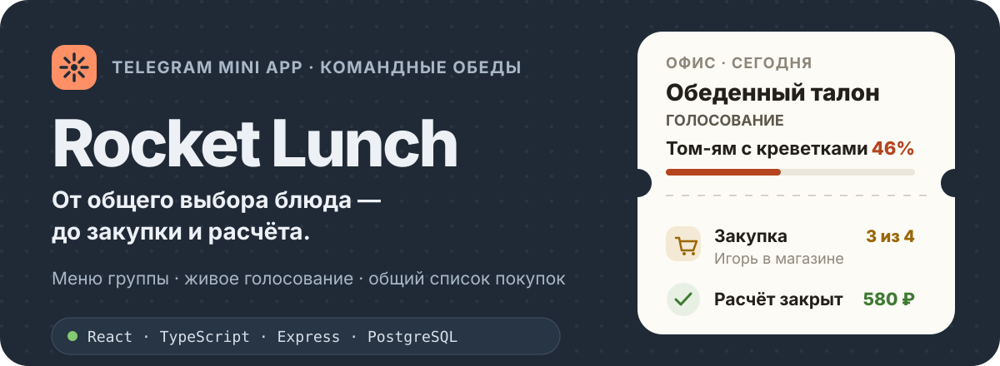
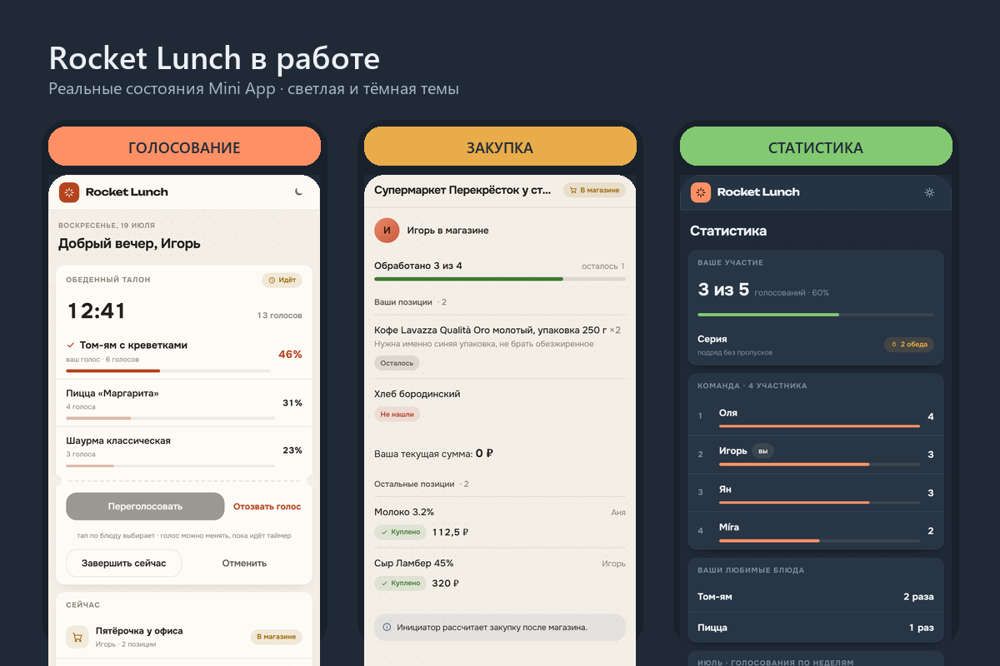
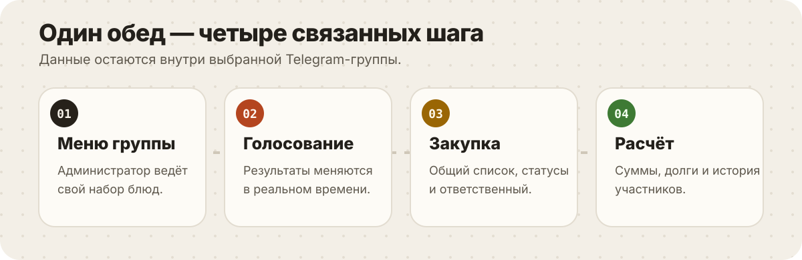
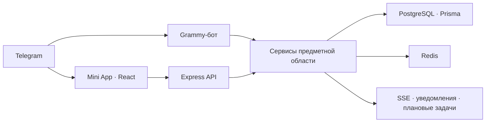

<p align="center">
  
</p>

<p align="center">
  <a href="https://github.com/GRIZZZZZLY/Lunch_bot/actions/workflows/ci.yml"></a>
  <a href="https://github.com/GRIZZZZZLY/Lunch_bot/actions/workflows/docker-build.yml"></a>
  
  <a href="./LICENSE"></a>
</p>

<p align="center">
  <strong>Rocket Lunch</strong> помогает Telegram-группе выбрать обед, собрать общий
  список покупок и рассчитаться без отдельных таблиц и переписки.
</p>

<p align="center">
  <a href="https://rocketlunch.dpdns.org"><strong>Открыть Mini App</strong></a>
  ·
  <a href="https://t.me/rocket_lunch_bot">Запустить бота</a>
  ·
  <a href="./docs/README.md">Документация</a>
</p>

## Приложение в работе

Это реальные состояния основного интерфейса: активное голосование, закупка в
магазине и командная статистика.

<p align="center">
  
</p>

## Что решает Rocket Lunch

- **Меню для каждой группы.** Администраторы управляют блюдами и предложениями,
  не затрагивая другие команды.
- **Живое голосование.** Участники видят текущий результат, могут изменить голос,
  а завершение и уведомления происходят автоматически.
- **Совместная закупка.** Группа собирает позиции, назначает покупателя,
  отслеживает найденные товары и закрывает поход в магазин.
- **Расчёты без ручной сверки.** Приложение хранит суммы, долги, переводы,
  историю участия и личную статистику.

<p align="center">
  
</p>

## Быстрый запуск

Понадобятся Node.js `>=22.13 <23`, npm 10+, PostgreSQL 16 и Docker Desktop.
Redis обязателен в рабочем окружении, а локально может быть отключён.

### 1. Подготовьте настройки

```powershell
Copy-Item backend/.env.example backend/.env
Copy-Item frontend-new/.env.example frontend-new/.env
```

Заполните как минимум `DATABASE_URL`, `BOT_TOKEN`, `JWT_SECRET`,
`TELEGRAM_BOT_USERNAME`, `WEBAPP_URL` и `CORS_ORIGIN`.

### 2. Запустите инфраструктуру

```powershell
docker compose up -d postgres redis
```

### 3. Установите зависимости и подготовьте базу

```powershell
npm --prefix backend ci
npm --prefix frontend-new ci
npm --prefix backend run db:generate
npm --prefix backend run db:push
```

### 4. Запустите сервер и интерфейс

В двух терминалах:

```powershell
npm --prefix backend run dev
```

```powershell
npm --prefix frontend-new run dev
```

Mini App будет доступен на [http://localhost:5174](http://localhost:5174),
API — на [http://localhost:3001](http://localhost:3001).

Для проверки внутри Telegram с временным HTTPS-адресом:

```powershell
.\start-prod-dev.ps1
```

Подробная инструкция: [установка и первый запуск](docs/01-getting-started/README.md).

## Как устроен проект



- `backend/` — TypeScript, Express, Grammy, Prisma, PostgreSQL и Redis;
- `frontend-new/` — основной интерфейс Rocket Lunch на React и Vite;
- `frontend/` — прежний интерфейс, временно сохранённый для отката;
- `docs/` — актуальная эксплуатационная и техническая документация.

Продакшен собирает `frontend-new` через `FRONTEND_DIR=frontend-new`.
Подробнее: [архитектура](docs/ARCHITECTURE.md) и
[карта рабочей системы](docs/09-production-readiness/SYSTEM_MAP.md).

## Проверка изменений

```powershell
# Сервер
npm --prefix backend run lint
npm --prefix backend run build:prod
npm --prefix backend test

# Основной интерфейс
npm --prefix frontend-new run type-check
npm --prefix frontend-new run lint
npm --prefix frontend-new test
npm --prefix frontend-new run build

# Критические пользовательские сценарии
npm --prefix frontend-new run test:e2e:smoke
```

Серверные интеграционные тесты требуют отдельной тестовой базы PostgreSQL.
Полный порядок описан в [руководстве по тестированию](docs/05-testing/README.md).

## Документация

- [Разработка](docs/02-development/README.md)
- [Обзор API](docs/07-api/README.md)
- [Развёртывание](DEPLOYMENT.md)
- [Выпуск и откат](docs/09-production-readiness/RELEASE_RUNBOOK.md)
- [Резервное копирование](docs/BACKUP_RESTORE_GUIDE.md)
- [Остаточные риски](docs/09-production-readiness/RESIDUAL_RISKS.md)
- [Как внести изменение](.github/CONTRIBUTING.md)

## Лицензия

Проект распространяется по лицензии [MIT](LICENSE).
