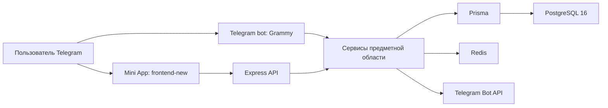

# Архитектура Rocket Lunch

## Общая схема



`backend` обслуживает API и бота в одном процессе с
`PROCESS_ROLE=full`. Архитектура допускает раздельные роли API и бота, но
включать их следует только после проверки общего состояния в Redis.

## Сервер

```text
backend/src/
├── api/
│   ├── controllers/  — перевод HTTP в вызовы предметной области
│   ├── middleware/   — вход, роли, ограничения и журналирование
│   ├── routes/       — регистрация маршрутов
│   └── server.ts     — сборка Express-приложения
├── bot/
│   ├── commands/     — /start, /help, /menu и /app
│   ├── events/       — события групп и системные события Telegram
│   ├── handlers/     — callback, оплаты и голосования
│   └── keyboards/    — клавиатуры и глубокие ссылки
├── services/         — предметная логика
├── database/         — Prisma-клиент и заполнение данными
├── jobs/             — плановые задания
├── types/            — общие типы
└── utils/            — конфигурация, журналирование и помощники
```

Контроллер не должен содержать сложную предметную логику. Проверки прав,
атомарные переходы состояния и транзакции находятся в сервисах.

## Основной интерфейс

```text
frontend-new/src/
├── app/          — запуск и верхнеуровневая композиция
├── components/   — общие элементы
├── features/     — пользовательские сценарии
├── hooks/        — запросы и мутации React Query
├── lib/          — Telegram, состояние и инфраструктура
├── pages/        — экраны
├── services/     — REST-клиенты
└── styles/       — темы и токены
```

`frontend-new` — единственный интерфейс. Исходники прежнего каталога
`frontend` удалены 2026-08-03: он не участвовал в продакшене
(`FRONTEND_DIR=frontend-new`), но занимал отдельное задание в CI и требовал
поддержки при каждой правке общих токенов и зависимостей. Остаток каталога —
пять неотслеживаемых `.env` — удалён 2026-08-22 вместе со сломанным
`deploy-prod-dev-vps.sh`, который на них опирался. **Отката к этому интерфейсу
нет:** в git его исходники доступны только как история, работоспособного дерева
там нет.

## Предметные области

- пользователи, группы и роли;
- групповое меню и предложения;
- голосования, голоса и результаты;
- закупки и позиции участников;
- расчёты, долги и оплаты;
- повторяющиеся голосования и плановые задания;
- игровые механики, сезоны и статистика;
- Telegram Stars и уведомления.

Каждая операция с групповыми данными проверяет `groupId`, членство и роль на
сервере. Клиент передаёт команду явно, держит её в ключах кэша и в
идентичности изменяющих операций; объект, открытый по ссылке, делает текущей
свою команду.

## Данные

PostgreSQL — единственная рабочая база. Prisma управляет схемой и миграциями.
Сырой SQL допустим в миграциях и там, где Prisma не выражает операцию вовсе, —
сейчас это блокировки строк: захват заданий очереди (`FOR UPDATE SKIP LOCKED`)
и упорядочивание подтверждений долгов одного опроса (`FOR NO KEY UPDATE`).
Такой SQL проверяется тестами на настоящей PostgreSQL, а время в нём
сравнивается как `NOW() AT TIME ZONE 'UTC'`: Prisma пишет в колонки без пояса
UTC, а голый `NOW()` зависит от пояса сервера.

## Уведомления о деньгах

Переходы долга — отметка, её отмена, подтверждение, отмена подтверждения,
массовое подтверждение, магазинные отметка и подтверждение — пишут задание на
уведомление в таблицу `outbox_events` в той же транзакции, что и сам переход.
Telegram вызывается после фиксации: немедленной попыткой и обработчиком
очереди, который повторяет временные ошибки с паузой и уводит постоянный отказ
адресата в `FAILED`. Задание, чья версия перехода устарела, не отправляется.

Гарантия — «хотя бы один раз»: между отправкой и записью результата остаётся
окно, в котором возможен дубль. Ответ операции от Telegram не зависит.
Сообщения о создании долга пока идут мимо очереди — см.
[остаточные риски](09-production-readiness/RESIDUAL_RISKS.md).

Redis в продакшене используется для распределённых блокировок, повторяемости
запросов и общего состояния, которое нельзя держать только в памяти процесса.

## Обновления

Основной интерфейс получает изменения голосований через защищённый поток
`/api/polls/:pollId/stream`. JWT передаётся в заголовке, а не в адресе.
После мутаций React Query точечно обновляет или сбрасывает связанные запросы.

## Безопасность

- Telegram `initData` проверяется сервером и имеет ограниченный срок действия;
- после входа используется JWT;
- доступ к группе проверяется независимо от данных клиента;
- входные данные ограничиваются и проверяются;
- CORS, Helmet и ограничения частоты включаются конфигурацией;
- секреты не попадают в Git, журналы и адреса запросов.

Текущие риски и условия выпуска:
[docs/09-production-readiness/](09-production-readiness/).

## Выпуск

GitHub Actions собирает конкретный коммит, применяет миграции, активирует
неизменяемый релиз и проверяет `/health`. PM2 управляет процессом, Nginx
завершает TLS и проксирует запросы.

Подробности: [DEPLOYMENT.md](../DEPLOYMENT.md).
