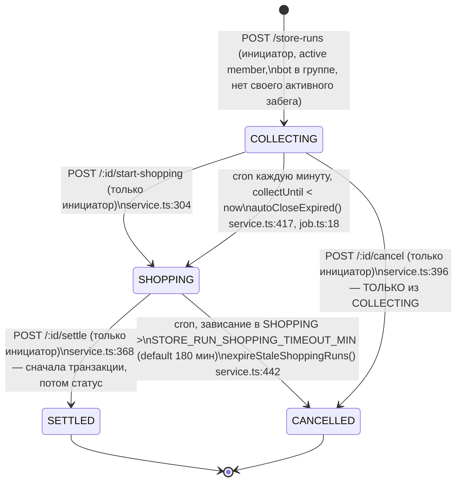

# Store Run — state machine и аудит семантики (по коду бэкенда)

Дата аудита: 2026-07-17. Источники истины:
- `backend/src/services/store-run.service.ts`
- `backend/src/api/controllers/store-run.controller.ts`
- `backend/src/api/routes/store-run.routes.ts`
- `backend/src/jobs/store-run-autoclose.job.ts`
- `backend/src/services/budget.service.ts` (settle → Transaction)
- `backend/prisma/schema.prisma` (модели `StoreRun` :747, `StoreItem` :806)

Фронтенд (frontend-new): `src/pages/StoreRunPage.tsx`, `src/hooks/useStoreRun.ts`,
`src/services/store-run.service.ts` (типы живут здесь, отдельного файла в `src/types/` нет),
`src/components/rl/CreateStoreRunSheet.tsx`.

---

## 1. Диаграмма состояний

Ключевые свойства:
- Оба cron-перехода — **атомарные условные updateMany со статус-гардом** (service.ts:424, :447), гонок «воскрешения» нет. Cron регистрируется в `backend/src/index.ts:60`, расписание `STORE_RUN_AUTOCLOSE_CRON`, default `* * * * *` (job.ts:13).
- Из `SHOPPING` **нельзя отменить вручную** — cancel разрешён только в COLLECTING (service.ts:398). Выйти из SHOPPING можно только через settle или таймаут-отмену кроном.
- Обратных переходов нет. SETTLED и CANCELLED терминальны: все write-операции отвечают `409 WRONG_STATUS`.
- Статусы позиции: `REQUESTED → BOUGHT | NOT_FOUND` (только в SHOPPING, только инициатор, service.ts:325). Между BOUGHT и NOT_FOUND можно переключать повторно до settle («Допускается повторная правка до settle», service.ts:322–324), **обратно в REQUESTED — нельзя** (enum схемы `['BOUGHT','NOT_FOUND']`, controller.ts:34–37).

## 2. Таблица endpoints

Все под `telegramAuthMiddleware` (routes.ts:9); write — `writeLimiter`; create/addItems/price/start-shopping/settle/cancel — ещё и idempotency middleware (routes.ts:12, 19–34).

| Метод | Путь | Кто может | Условие статуса | Возвращает |
|---|---|---|---|---|
| POST | `/api/store-runs` | active member группы + бот может постить в группу (controller.ts:84) + у инициатора нет активного забега (service.ts:88–100) | — | 201, `StoreRun` |
| GET | `/api/store-runs/active` | любой авторизованный | — | активные (COLLECTING/SHOPPING) забеги **во всех группах юзера**; items — только свои (service.ts:161–171) |
| GET | `/api/store-runs/:id` | член группы забега (service.ts:142–145, иначе 403) | — | `StoreRun` + initiator + items(+user) + group |
| POST | `/api/store-runs/:id/items` | active member группы (service.ts:201–206) | COLLECTING (service.ts:193) | 201, `StoreItem[]` (1–20 шт, controller.ts:15–26) |
| PATCH | `/api/store-runs/:id/items/:itemId` | **только владелец позиции** (service.ts:248) | COLLECTING (service.ts:251) | `StoreItem` |
| DELETE | `/api/store-runs/:id/items/:itemId` | **только владелец позиции** (service.ts:288) | COLLECTING (service.ts:291) | 204 |
| POST | `/api/store-runs/:id/items/:itemId/price` | **только инициатор** (service.ts:338) | SHOPPING (service.ts:341) | `StoreItem` (status BOUGHT+price ≥ 0, либо NOT_FOUND+price=null) |
| POST | `/api/store-runs/:id/start-shopping` | только инициатор (service.ts:305 → requireInitiator :463) | COLLECTING | `StoreRun` |
| POST | `/api/store-runs/:id/settle` | только инициатор (service.ts:369) | SHOPPING | `StoreRun` (без breakdown!) |
| POST | `/api/store-runs/:id/cancel` | только инициатор (service.ts:397) | COLLECTING | `StoreRun` |

Коды ошибок: `NOT_FOUND`→404, `FORBIDDEN`→403, `WRONG_STATUS`/`ACTIVE_RUN_EXISTS`/`BOT_NOT_IN_GROUP`→409, `INVALID_INPUT`→400 (controller.ts:49–66).

## 3. Ответы на вопросы 1–7

### Q1. `item.price` — за единицу или за позицию? Учитывается ли quantity?

**Price — де-факто цена за всю позицию (строку); `quantity` НЕ участвует ни в одном денежном расчёте бэкенда.**

- Settle: `budget.service.ts:1472–1483` — `const amount = item.price as Prisma.Decimal;` → `{ amount, itemPrice: amount }`. Умножения на `quantity` нет.
- Grep `quantity` по `budget.service.ts` и `notification.service.ts` — **0 совпадений**: количество не фигурирует ни в суммах, ни в текстах долговых уведомлений.
- `quantity` (1..99, schema.prisma:811, service.ts:267) — чисто информационное поле «сколько штук взять».

Следствие: инициатор в магазине должен вводить **суммарную цену строки** («Молоко ×3» → цена за все три). Ни бэкенд, ни фронт это явно не сообщают — семантическая ловушка, но фронтовое суммирование `price` без `quantity` **совпадает с бэкендом** (не баг фронта, а недокументированная семантика).

### Q2. Истечение `collectUntil`

**Cron, автопереход COLLECTING→SHOPPING.** `initStoreRunAutoCloseJob()` (job.ts:12, регистрируется в `index.ts:60`) раз в минуту (`STORE_RUN_AUTOCLOSE_CRON` ?? `'* * * * *'`, job.ts:13):
1. `autoCloseExpired()` (service.ts:417–434): атомарный `updateManyAndReturn({ where: { status: 'COLLECTING', collectUntil: { lt: now } }, data: { status: 'SHOPPING', shoppingAt: now } })` + уведомления участникам (`notifyShoppingStarted`) и инициатору (`notifyInitiatorCollectionClosed`) — job.ts:28–43.
2. Бонус-переход: `expireStaleShoppingRuns()` (service.ts:442–457) — SHOPPING старше `STORE_RUN_SHOPPING_TIMEOUT_MIN` (default **180 мин**) → CANCELLED + удаление сообщений + `notifyStoreRunExpired` (job.ts:48–59).

Важно: **между collectUntil и фактическим переходом может пройти до минуты** — фронт не должен считать `collectUntil` мгновенной границей; истина — поле `status`.

### Q3. Может ли НЕ-инициатор редактировать свою позицию?

**Да.** `PATCH /:id/items/:itemId` → `updateItem` (service.ts:238–277): проверки — позиция существует, `item.userId === userId` (:248, иначе `FORBIDDEN: 'You can only edit your own items'`), статус забега `COLLECTING` (:251). Роль инициатора не проверяется вовсе — **инициатор НЕ может редактировать чужие позиции**, участник может редактировать только свои и только до закрытия сбора. Редактируемые поля: name (≤200), quantity (1..99), notes (≤500) — service.ts:258–274.

### Q4. Возврат из BOUGHT/NOT_FOUND в REQUESTED?

**Нет.** `SetPriceSchema.status: z.enum(['BOUGHT', 'NOT_FOUND'])` (controller.ts:36), сигнатура `setItemPrice(..., status: Extract<StoreItemStatus, 'BOUGHT' | 'NOT_FOUND'>)` (service.ts:329). `REQUESTED` передать невозможно. Однако до settle допустима **повторная правка BOUGHT↔NOT_FOUND** и смена цены (service.ts:322–324; статус-гард только `=== 'SHOPPING'`, :341). Эквивалент отката «в неизвестно» — перевести в NOT_FOUND (price обнуляется, :358).

### Q5. Одна активная закупка на группу?

**Нет — лимит на ИНИЦИАТОРА, не на группу.** service.ts:88–100: `findFirst({ where: { initiatorId, status: { in: ['COLLECTING','SHOPPING'] } } })` → `ACTIVE_RUN_EXISTS` (409). `groupId` в условии нет: **в одной группе могут одновременно идти несколько закупок от разных инициаторов**, и один инициатор блокируется даже на закупку в другой группе.

### Q6. Скоупится ли список активных закупок по группе?

**Да, по всем группам пользователя.** `getActiveStoreRunsForUser` (service.ts:153–172): собирает `groupIds` из активных членств (`groupMember.findMany({ where: { userId, isActive: true } })`) и фильтрует `groupId: { in: groupIds }`. Чужие группы не видны. В этом списке `items` дополнительно сужены до позиций самого пользователя (`items: { where: { userId } }`, :168). Детальный `GET /:id` тоже защищён членством (service.ts:142–145).

### Q7. Что создаёт settle?

`settle` (service.ts:368–391): сначала `BudgetService.createTransactionsForStoreRun(storeRunId)` (:377), затем `status: 'SETTLED', settledAt` (:379–382). Если создание транзакций упало — статус остаётся SHOPPING, можно повторить (:366).

`createTransactionsForStoreRun` (budget.service.ts:1446–1505):
- Берутся только позиции `status === 'BOUGHT' && price != null && userId !== initiatorId` (:1460–1465) — **NOT_FOUND, REQUESTED и собственные позиции инициатора долгов не создают**.
- **Одна `Transaction` на каждую billable-позицию**: `fromUserId = item.userId` (должник), `toUserId = initiator`, `amount = itemPrice = item.price` (без quantity), `status: 'PENDING'` (:1472–1483).
- Идемпотентно: `createMany({ skipDuplicates: true })` + уникальный индекс `(storeRunId, storeItemId)` (:1485–1489) — двойной клик не задваивает долги; плюс idempotency middleware на роуте.
- Если billable-позиций нет — транзакций 0, но забег всё равно становится SETTLED (:1467–1470 → service.ts:379).

**Per-participant breakdown в ответе API НЕТ**: `POST /:id/settle` возвращает только обновлённый `StoreRun` (controller.ts:327, 346). Группировка по должникам существует только внутри Telegram-уведомлений: `notifyStoreRunSettled` строит `Map<debtorId, Tx[]>` и шлёт ЛС каждому должнику + сводку инициатору (budget.service.ts:1518–1565). Фронту для экрана SETTLED breakdown придётся считать самому из `run.items` (price × владелец) — данных в `GET /:id` достаточно.

**Валидации полноты нет**: settle проходит, даже если часть позиций осталась `REQUESTED` — они молча выпадают из расчёта. Фронт тоже не проверяет (StoreRunPage.tsx:146–150).

## 4. Матрица прав (Q8)

Роли: **I** = инициатор, **P** = участник (active member группы), **X** = прочий (не член группы — везде 403 FORBIDDEN на уровне сервиса, включая GET :id).

| Действие | COLLECTING | SHOPPING | SETTLED | CANCELLED | Фронт совпадает? |
|---|---|---|---|---|---|
| add item | I, P (service.ts:193–206) | — (409) | — | — | ✅ кнопка при COLLECTING для всех (StoreRunPage.tsx:129–133) |
| edit item | владелец позиции (I — только свои) (service.ts:248–256) | — | — | — | ⚠️ **фронт вообще не подключил редактирование** — `useUpdateStoreItem` есть (useStoreRun.ts:76–83), но StoreRunPage его не импортирует (tsx:4–12) |
| delete item | **только владелец** (service.ts:288–296) | — | — | — | ❌ **расхождение**: фронт показывает корзину инициатору на ЧУЖИХ позициях — `canDelete = COLLECTING && (mine \|\| isInitiator)` (StoreRunPage.tsx:98) → бэкенд ответит 403 |
| set price (BOUGHT) | — (409) | **только I** (service.ts:338–346) | — | — | ✅ кнопка «Цена» при `SHOPPING && isInitiator` (tsx:115–117); ⚠️ фронт требует price > 0 (tsx:276), бэкенд допускает 0 (service.ts:349) |
| mark NOT_FOUND | — | только I | — | — | ✅ сегмент «Не нашли» в PriceSheet (tsx:298–305) |
| close collection (start-shopping) | только I (service.ts:304–311) | — (409) | — | — | ✅ (tsx:136–144); фронт строже: `disabled` при 0 позиций (tsx:141), бэкенд разрешил бы пустой забег |
| cancel | **только I, только COLLECTING** (service.ts:396–403) | — (409!) | — | — | ✅ кнопка только при `isInitiator && COLLECTING` (tsx:136–139); из SHOPPING отмены нет и на фронте, и на бэке |
| settle | — (409) | только I (service.ts:368–375) | — | — | ✅ (tsx:146–150); ни фронт, ни бэк не требуют, чтобы все позиции были обработаны |
| view run (GET :id) | I, P | I, P | I, P | I, P | ✅ страница доступна; X получит 403 → фронт покажет «Закупка не найдена» (нет отдельного 403-состояния) |
| create run | active member + без своего активного забега + бот в группе | | | | ❌ **расхождение**: пресеты сбора `[15, 30, 60]` мин (CreateStoreRunSheet.tsx:5), а бэкенд принимает **3..30** (controller.ts:12; service.ts:11–12) → выбор «60 мин» = гарантированный 400 |

## 5. UX-разрывы текущего экрана (frontend-new, с file:line)

Подтверждённые гипотезы:
1. **`collectUntil` нигде не отображается, живого таймера нет** — StoreRunPage.tsx не обращается к `run.collectUntil` ни разу (поле есть в типе, service.ts:37). Пользователь не знает, сколько осталось до закрытия сбора; обновление статуса — только через refetch раз в 15 с (useStoreRun.ts:42–47).
2. **Товары не сгруппированы по участникам** — плоский список `run.items` в порядке `createdAt` (tsx:96–123), имя владельца — мелкой серой подстрокой (tsx:106–109). В SHOPPING инициатору это ок (чеклист), в COLLECTING участникам неудобно найти «своё».
3. **Редактирование позиции не подключено** — `useUpdateStoreItem` (useStoreRun.ts:76) не используется страницей; участник может только удалить и добавить заново.
4. **Удаление позиции и отмена закупки — без подтверждения** — `deleteItem.mutate(it.id)` прямо из onClick (tsx:119), `cancel.mutate()` тоже (tsx:138). Отмена — деструктивное действие на весь групповой процесс.
5. **Цена — отдельная модалка на каждую позицию** — PriceSheet открывается per-item (tsx:116, 179–193): для 15 позиций это 15 циклов «тап → сегмент → цифры → Сохранить» одной рукой в магазине.
6. **Итог складывает `price` без `quantity`** (tsx:52) — **относительно бэкенда это КОРРЕКТНО** (settle тоже игнорирует quantity, budget.service.ts:1472), но семантика «цена за строку, не за штуку» нигде не подсказана ни вводящему цену инициатору (PriceSheet, tsx:308 — просто «Цена, ₽»), ни участнику. Риск: инициатор введёт цену за штуку → участник недоплатит.
7. **Нет error/retry состояний** — используется только `isLoading` и `!run` (tsx:39, 66–67): ошибка сети/403/500 отображается как «Закупка не найдена» без кнопки повтора; `isError` из React Query не читается.

Дополнительно найденные:
8. **Пресет «60 мин» в CreateStoreRunSheet ломается о валидацию бэкенда 3..30** (Sheet.tsx:5 vs controller.ts:12) — тихий 400 при самом «щедром» выборе.
9. Итог в шапке включает цены как есть и не отличает «Итого закупки» от «мой долг»; для не-инициатора полезнее его личная сумма.
10. `NOT_FOUND`-бейдж есть (tsx:111), но нет прогресса обработки («обработано 5 из 8») и нет предупреждения при settle с необработанными REQUESTED-позициями (бэкенд их молча выкинет из долгов — см. Q7).
11. Инициатор не видит per-должник breakdown после settle — экран SETTLED показывает только общий итог (tsx:151–161), хотя данных `GET /:id` достаточно, чтобы посчитать.
12. Двойное состояние «не член группы» (403) и «нет забега» (404) склеены в одно сообщение.

## 6. Требования к новому UX по статусам

### COLLECTING
- Шапка: имя магазина (`storeName`), статус-бейдж, **дедлайн `collectUntil` + живой таймер обратного отсчёта** (клиентский setInterval; по достижении нуля — состояние «сбор закрывается…» + принудительный refetch, помня про лаг крона до 1 минуты).
- Блок участников: аватары всех, кто добавил позиции (уникальные `item.user`), счётчик «N участников · M позиций».
- **Группировка позиций по участникам**, секция «Мои позиции» — первой.
- Участник: добавить (bulk до 20 за раз — бэкенд уже умеет, controller.ts:25), **редактировать своё** (подключить `useUpdateStoreItem` — name/quantity/notes), удалить своё **с подтверждением**.
- Инициатор: «Закрыть сбор» (disabled при 0 позиций — оставить), «Отменить» **с confirm-диалогом**; чужие позиции — read-only (убрать корзину, см. расхождение №1).
- Empty state: «Пока пусто — добавьте первым» + CTA.
- Expired edge: если `collectUntil` в прошлом, а статус ещё COLLECTING — показывать «Сбор закрывается…», блокировать добавление опционально не нужно (бэкенд ещё примет до перехода), но предупредить.
- Пресеты создания: привести к диапазону бэкенда — например `[5, 15, 30]` мин, либо расширить лимит на бэке.

### SHOPPING (режим «одной рукой в магазине», только инициатор видит контролы)
- Чеклист с **крупными тап-зонами** (вся строка — цель), группировка по участникам или по алфавиту с переключателем.
- **Inline-действия на строке**: «Куплено» (раскрывает поле цены прямо в строке, numeric-клавиатура, автофокус) и «Не нашли» одним тапом — без полноэкранной модалки на каждую позицию.
- Подсказка семантики цены: label «Цена за всё (×N шт), ₽» когда quantity > 1.
- Прогресс-бар «обработано K из M»; необработанные REQUESTED визуально выделены.
- Кнопка «Рассчитать»: с валидацией — при наличии REQUESTED показывать confirm «X позиций без цены не попадут в расчёт. Продолжить?»; допускать price = 0 (бэкенд допускает).
- Участники (не инициатор): read-only чеклист с живым прогрессом (refetch 15 с уже есть), «Инициатор в магазине».
- Показ таймаута: «Забег автоматически отменится через N ч, если не будет рассчитан» (STORE_RUN_SHOPPING_TIMEOUT_MIN=180).

### SETTLED (read-only)
- Итог закупки + **breakdown по участникам**: считать на клиенте из `run.items` (сумма BOUGHT-цен по `userId`, позиции инициатора — «своё, без долга»), т.к. API breakdown не отдаёт (Q7).
- Статусы позиций: куплено (с ценой) / не нашли.
- Блок «Долги созданы и разосланы в Telegram» + ссылка на бюджет-виджет (`queryKeys ['budget']` уже инвалидируются, useStoreRun.ts:124).
- Для должника: «Ваша часть: N ₽» первой строкой.
- Никаких кнопок мутаций; опрос остановлен (refetchInterval: false — уже так, useStoreRun.ts:45).

### CANCELLED (read-only)
- Причина: вручную инициатором (cancelledAt при status-переходе из COLLECTING) vs авто-отмена по таймауту SHOPPING — бэкенд причину не хранит, различать эвристикой: `shoppingAt != null` → «отменено автоматически: расчёт не был завершён», иначе «отменено инициатором».
- История позиций сохраняется read-only (данные не удаляются, удаляются только Telegram-сообщения — controller.ts:370).
- CTA «Создать новую закупку» для бывшего инициатора.

### Все статусы
- Отдельные состояния: loading / error (с Retry) / 403 «Вы не состоите в этой группе» / 404.
- Оптимистичные обновления или как минимум disabled-состояния на время мутаций (частично есть через `loading`).
